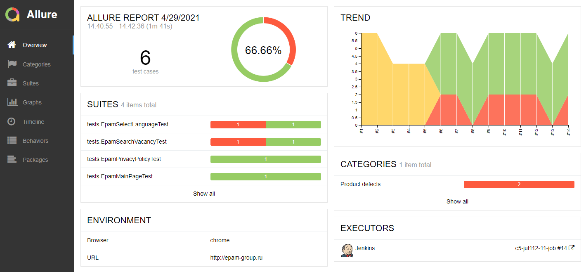
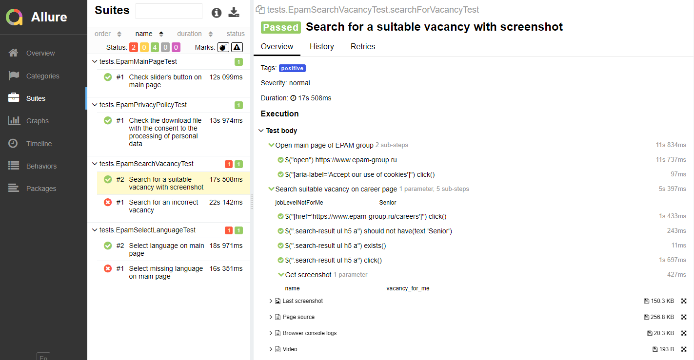
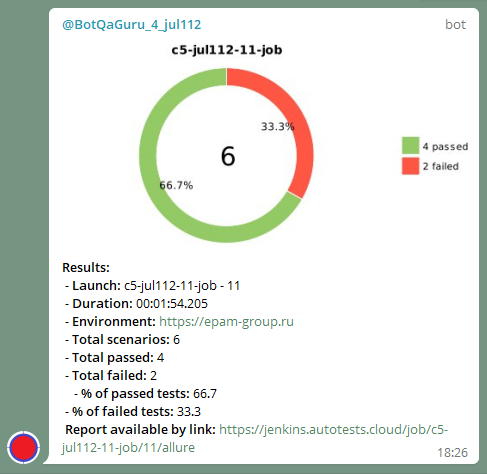

# Demo UI automation testing

## **Tech stack**
 

- Java
- Gradle
- Junit5
- Selenide
- Selenoid
- Docker
- Allure Report
- Jenkins
- Telegram-notifications
## **Description**
Demo testing UI of specific site

- It built in Jenkins CI. The tests have been executed in Docker containers using Selenoid. 
- The report generated automatically by Allure framework. It contains scenarios of tests, logs, screenshots and video.
- The result of build send to telegram with Telegram-notifications 
application.
## Allure reports
### *Overview of suit*

### *Details view*

### *Video from specific test*
Test "Change language on main page"

## Telegram notification
### Telegram notifications

## Links
[***Jenkins job***](https://jenkins.autotests.cloud/job/c5-jul112-11-job) 
[***Jenkins Allure report***](https://jenkins.autotests.cloud/job/c5-jul112-11-job/allure/) 
